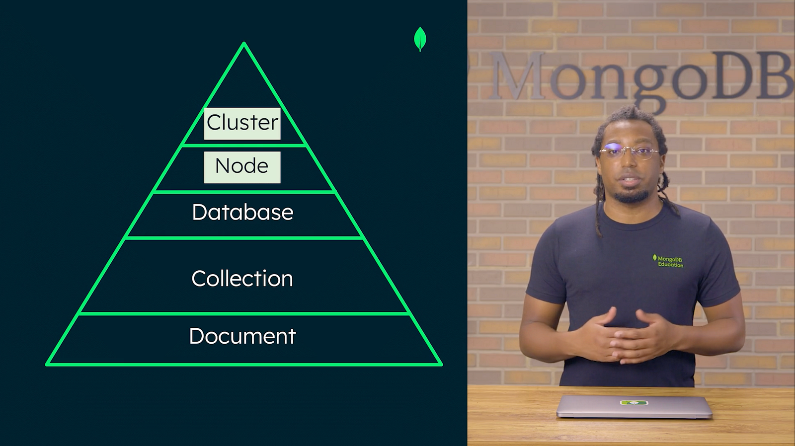
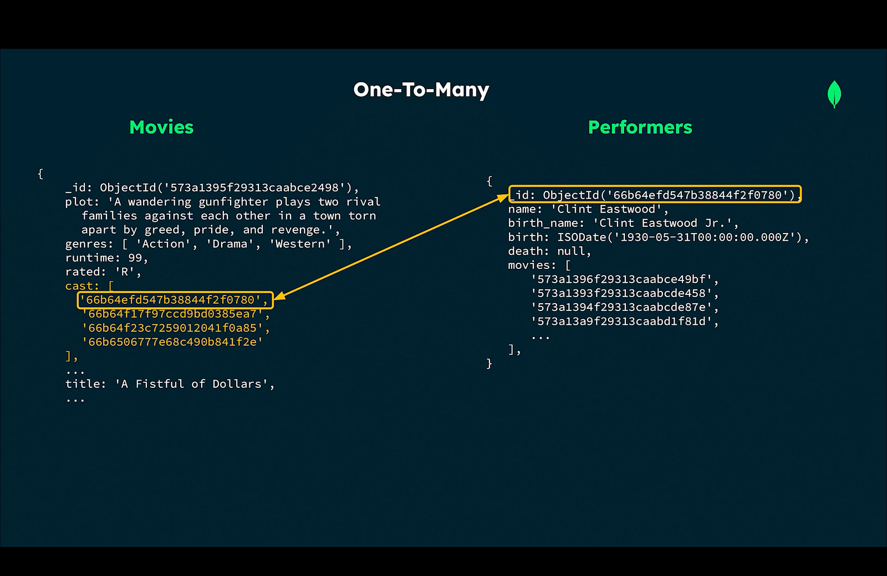
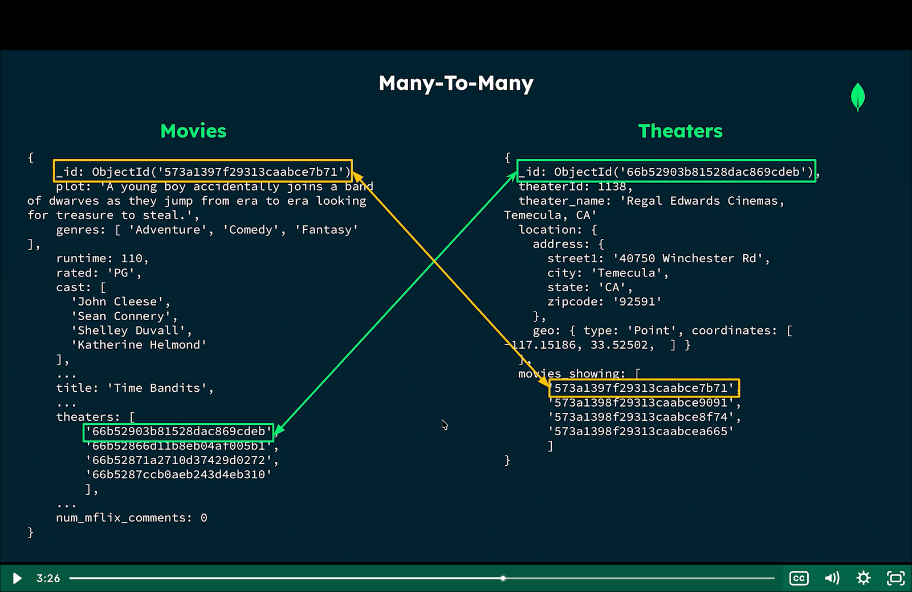

# MONGODB

**MongoDB** can be used without *atlas*, but atlas provide **DBaaS** [Database as a Service], provide deployment of mongoDB, safety, backup and enable data redundency. Database can be accessible via atlas UI, CLI or administration API.
\
**Atlas** is not just a database but a package providing unique features, like it contains drivers for many programming languages, or ODMs, atlas search provide suite of text search features, atlas vector search provide capability of generative ai and semantic search, atlas chart to build dashboard on the fly, also providing Data federation(data integration tools allowing query, transform, aggregate, write ) and Stream processing.
\
Atlas also has two features **SQL interface** (to run sql queries on mongoDB collection) and **Relational Migrator** (to transition relational db workloads to atlas).

## MongoDb Architecture


- MongoDB follows CAP theorem
- Document is at the lowest of the data which contains key-value pairs. MongoDB stores data in **BSON** (binary JSON designed to be lightweight, traversable and efficient). Document is flexible schema, providing ease of adding new field without making new schema or migration.
- BSON is easier to navigate. Datatypese supported Boolean, null, String, number(int32 and int64, double and decimal128), Object, Array, Dates(unix epoch), ObjectId

*The Data which is accessed together must be stored together in a single document.*
- 
- In **one to one relationship**, it is much better to embed related information in the single document.
- In **one to many relationships**, embedding is preffered approach if the data is accessed together but better to reference if dataset is large or accessed independently.
- In **many to many relationships**, either approach or both approach can be combined together.

Referencing Approach






## MongoDB connection

MongoDB provide two type of connection string: standard format and srv format, default is srv where mongodb query the dns for running cluster.
```
mongodb+[srv]://[username:password@]host1[:port1][,...hostN[:portN]][/[defaultauthdb][?options]]
```


