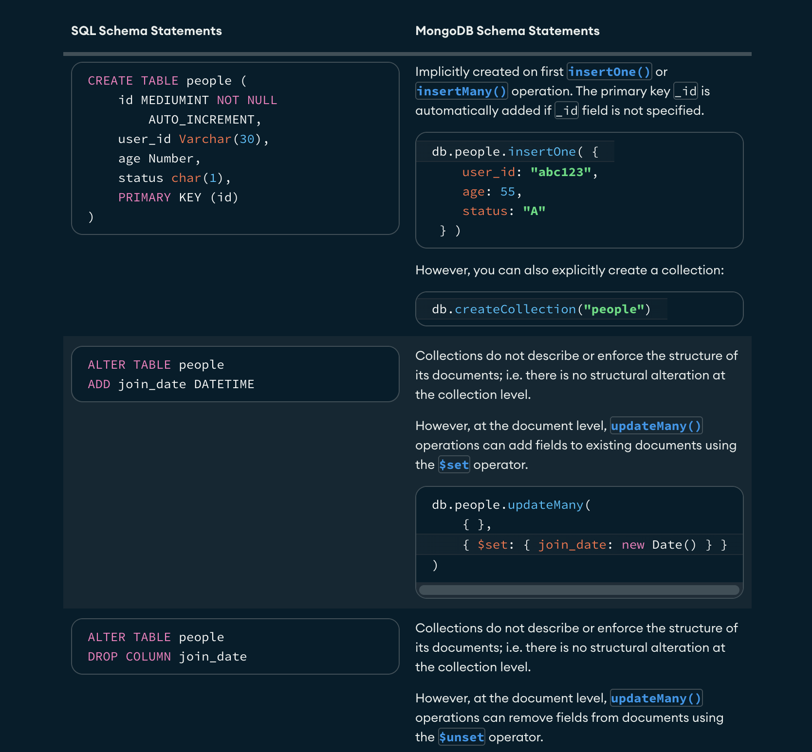
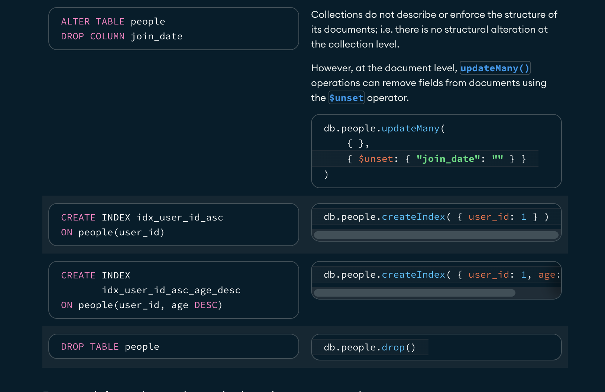
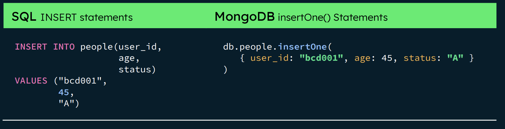
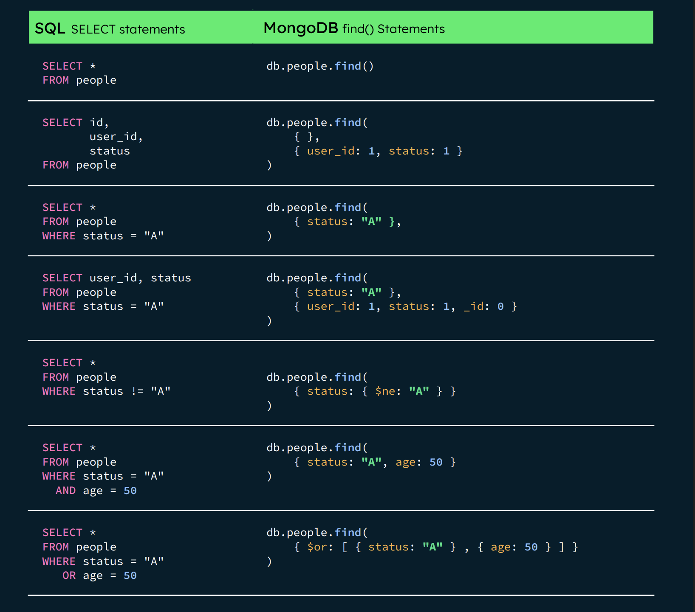
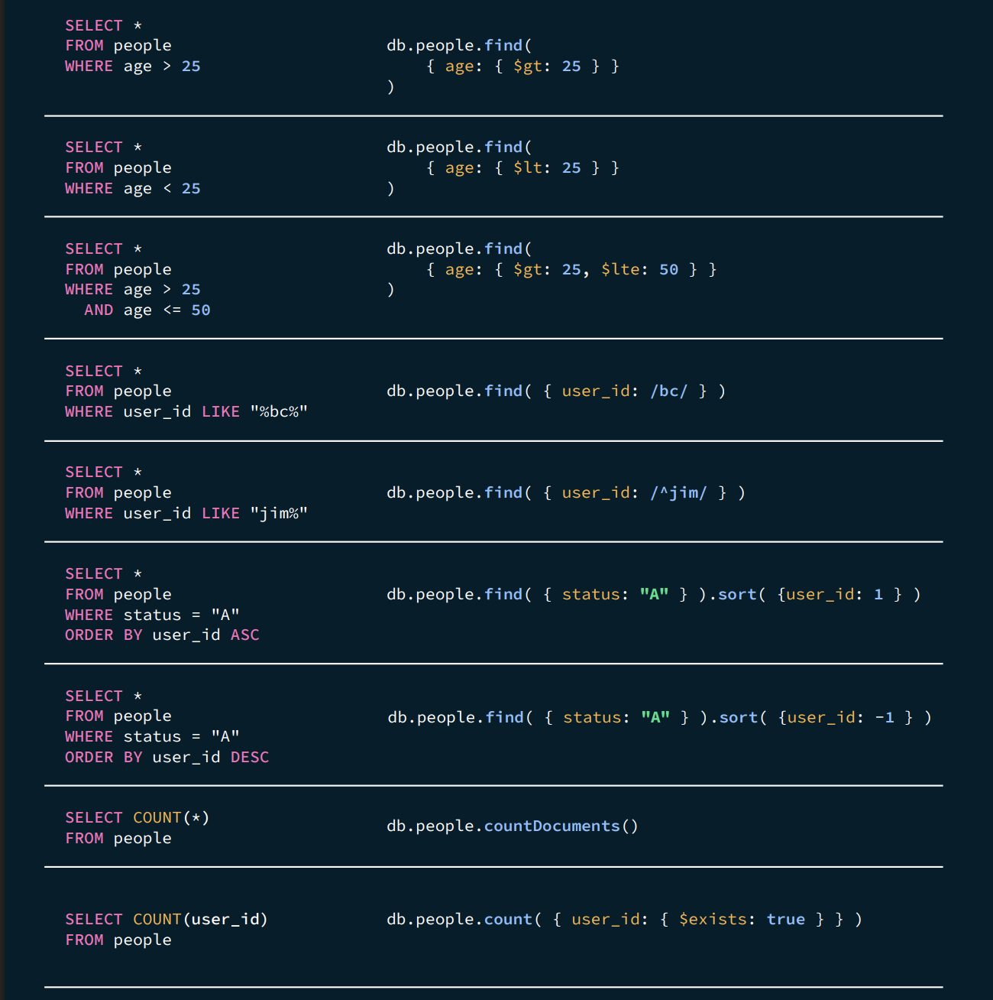
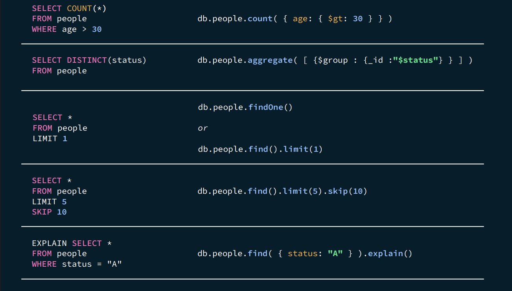
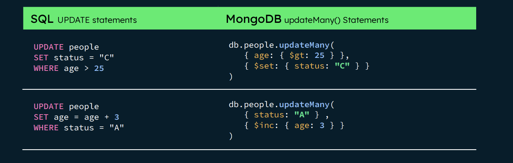
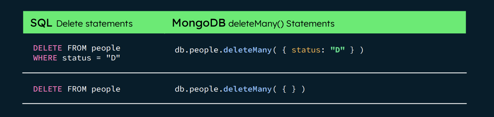
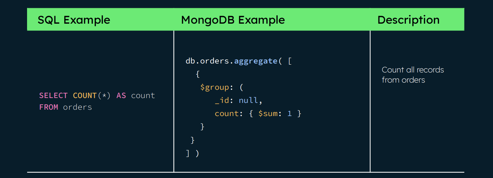
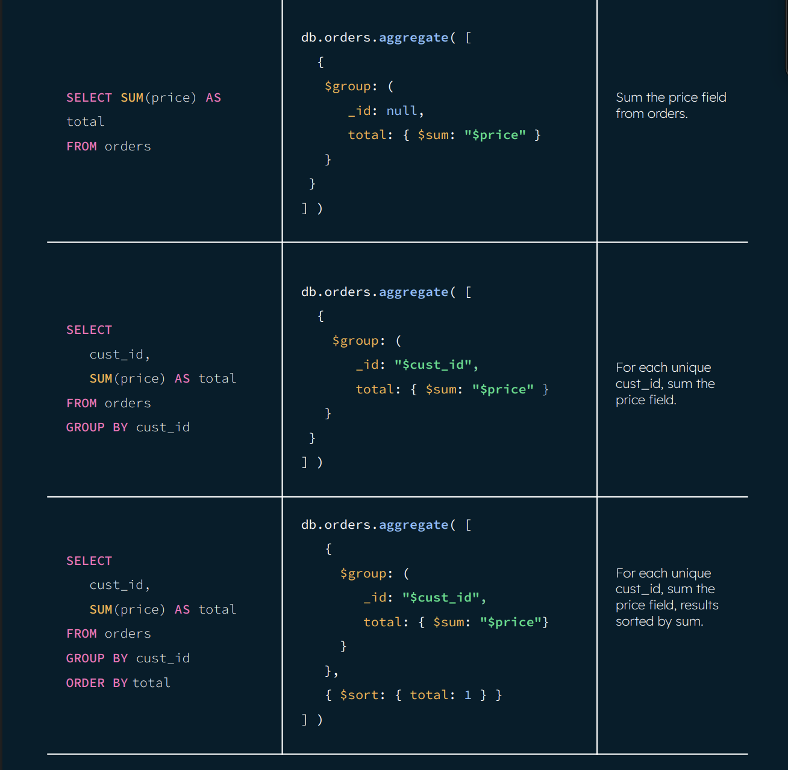

# SQL to MongoDB Cheat Sheet

## Key Concepts

The following table presents the various SQL terminology and concepts and the corresponding
MongoDB terminology and concepts.


|**SQL** Concepts| **MongoDB** Concepts|
| - | - | 
|database| database|
|table| collection|
|row| document or BSON document|
|column| field|
|index| index|
|table joins| `$lookup`, embedded documents|
|primary key| primary key (_id)|
|aggregation (e.g. group by)| aggregation pipeline|
|transactions| transactions|

### Executables

The following table presents some database executables and the corresponding MongoDB
executables. This table is not meant to be exhaustive.

| |MongoDB |MySQL |Oracle |PostGreSQL |SQL Server|
| - | - | - | - | - |  - |
|**Database server**| mongod |mysql |oracle |PostGreSQL |SQL Server
|**Database client**| mongosh |mysql |sqlplus |PGAdmin |SQL Server Management Studio

### Create and Alter
The following table presents the various SQL statements related to table-level actions and the
corresponding MongoDB statements.



### Insert
The following table presents the various SQL statements related to inserting records into tables
and the corresponding MongoDB statements.



### Select
The following table presents the various SQL statements related to reading records from tables
and the corresponding MongoDB statements.






### Update 
The following table presents the various SQL statements related to updating existing records in
tables and the corresponding MongoDB statements.



### Delete
The following table presents the various SQL statements related to deleting records from tables
and the corresponding MongoDB statements.




## SQL to Aggregation

The aggregation pipeline allows MongoDB to provide native aggregation capabilities that
correspond to many common data aggregation operations in SQL.
\
The following table provides an overview of common SQL aggregation terms, functions, and
concepts and the corresponding MongoDB aggregation operators

| SQL Terms, Functions and Concepts | MongoDB Aggregation Operators |
| :--- | :--- |
| `WHERE` | `$match` |
| `GROUP BY` | `$group` |
| `HAVING` | `$match` *(placed after `$group`)* |
| `SELECT` | `$project` |
| `ORDER BY` | `$sort` |
| `LIMIT` | `$limit` |
| `SUM()` | `$sum` |
| `COUNT()` | `$sum`, `$sortByCount` |
| `join` | `$lookup` |
| `SELECT INTO NEW_TABLE` | `$out` |
| `MERGE INTO TABLE` | `$merge` |
| `UNION ALL` | `$unionWith` |

---


### Aggregation Example

The following table presents a quick reference of SQL aggregation statements and the
corresponding MongoDB statements. The examples in the table assume the following conditions:
- The SQL examples assume two tables, orders and order_lineitem that join by
the order_lineitem.order_id and the orders.id columns.
- The MongoDB examples assume one collection orders that contain documents of
the following prototype:
```js
{
cust_id: "abc123",
ord_date: ISODate("2012-11-02T17:04:11.102Z"),
status: 'A',
price: 50,
items:[ {sku:"xxx", qty:25 , price:1 },
        {sku:"yyy", qty:25 , price:1 }
]
}
```



